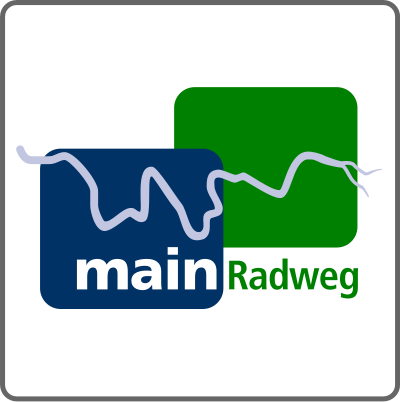
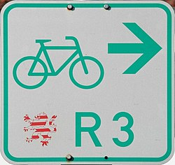
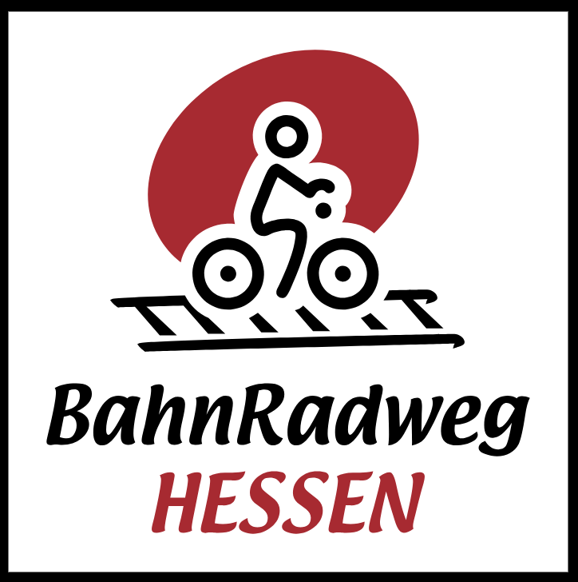
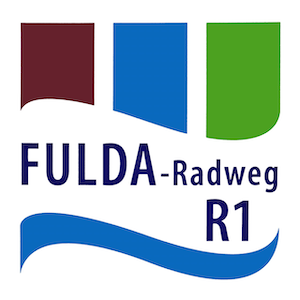
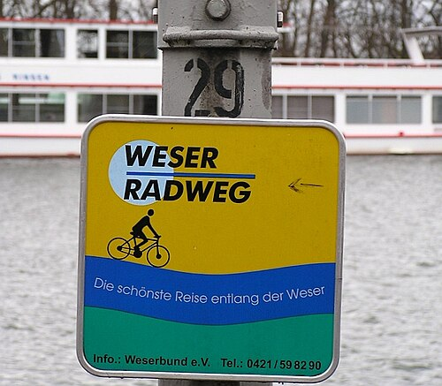
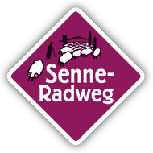
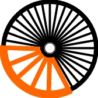
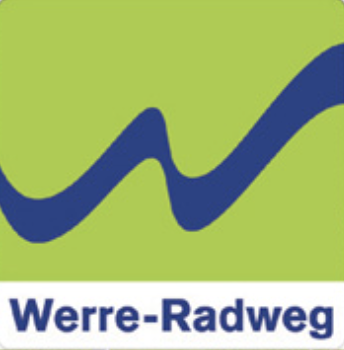
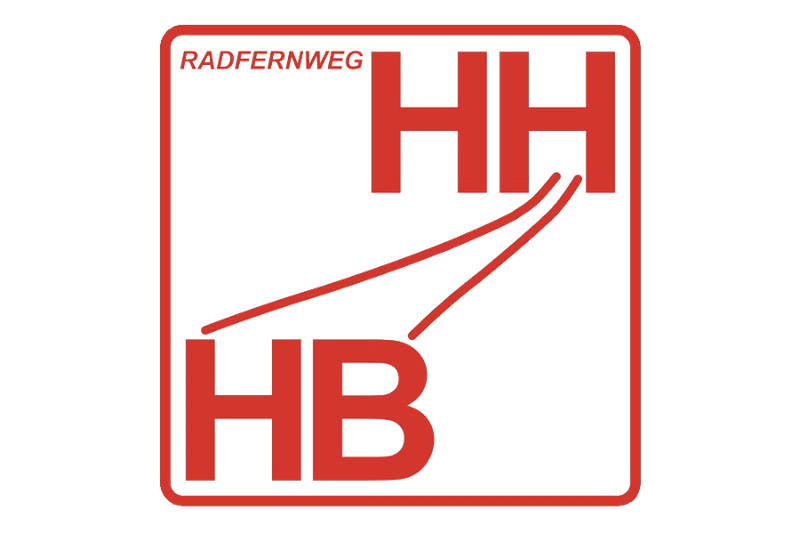
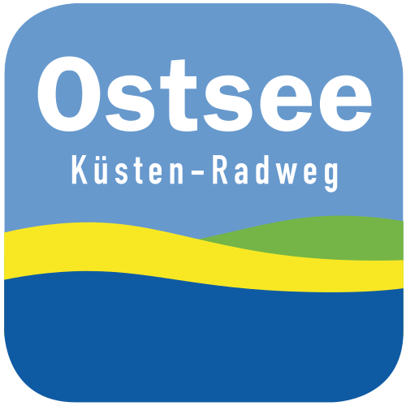

[modeline]: # ( vim: set fenc=utf-8 filetype=markdown ts=3 sts=3 sw=3 expandtab: )
# 2025 Radtour Frankfurt/Main -> Kopenhagen

Notizen und Planung für die Radtour Frankfurt -> Kopenhagen

## Frankfurt/Main [km 0]

   Auf dem [Mainradweg](#Mainradweg) bis nach Rumpenheim -> Fähre auf das linke Mainufer.

   Links des Mains auf dem [R3](#Hessischer-Radfernweg) bis nach Kesselstadt.

   Weiter auf dem [Bahnradweg Hessen](#Bahnradweg-Hessen) über Mittelbuchen, Windecken, Eichen bis nach Altenstadt.

   Ab Altenstadt geht es auf den [Vulkanradweg](#Vulkanradweg) bis nach Schlitz.  
   Nach 88 km erreichen wir in Hartmannshain den höchsten Punkt des Vulkanradwegs und der gesamten Tour.  
   Am Zusammenfluss von Schlitz und Fulda geht es weiter auf dem [Fuldaradweg](#Fuldaradweg).

   Ab Schlitz geht es auf dem [Fuldaradweg](#Fuldaradweg) bis nach Hann. Münden zum Beginn des [Weserradwegs](#Weserradweg).  
   Kilometer 287, am Weserstein beginnt die Weser und unsere Reise am [Weserradweg](#Weserradweg).

   In Godelheim verlassen wir die [Weser](#Weserradweg) und fahren zu einem kurzen Abstecher nach Paderborn.  
   Hierfür ist es wichtig spätestens in Beverungen auf die linke Weserseite zu wechseln.

   [Roadbook](roadbook/frankfurt-paderborn.md)

## Paderborn [km 420]
   
   Von Paderborn über den [Senne-Radweg](#Senne-Radweg) nach Horn.  
   Dort auf den [Werre-Radweg](#Werre-Radweg) um wieder an die [Weser](#Weserradweg) zu kommen.  
   Dabei geht es durch Detmold, Lage, Herford, Bad Oeynhausen bis zum Werre-Weser-Kuss.

   Am Werre-Weser-Kuss geht es wieder auf den [Weserradweg](#Weserradweg) auf dem wir bis Bremen bleiben.

## Bremen [km 690]

   Ab Bremen geht es auf dem [Radfernweg Hamburg-Bremen](#Radfernweg-Hamburg-Bremen) bis nach Hamburg.

   In Hamburg an der Elbe südwärts bis nach Lauenburg/Elbe und ab dort Richtung Norden. Das alles entlang des 
   [Radweg Hamburg-Rügen](#Radweg-Hamburg-Rügen) bis nach Mölln.

   Von Mölln folgen wir dem [Elbe-Lübeck-Kanal](#Elbe-Lübeck-Kanal) bis nach Lübeck.  
   Am Holstentor vorbei zur Trave und an dieser bis nach Travemünde.

   In Travemünde treffen wir auf die [Ostseeküstenroute D2](#Ostseeküstenroute).  
   Auf diesem fahren wir bis nach Puttgarden.

## Puttgarden/Rødby [km 1.095/km 1.115]

   Auf der dänischen Seite angekommen - in Rødbyhavn - folgen wir der [Nationalen Fahrradroute 7](#Sjællands-Odde-Rødbyhavn) bis nach Vordingborg.
   Von dort geht es weiter auf dem Radweg [Køge - Præstø - Vordingborg](#Køge-Præstø-Vordingborg).  
   In Køge angekommen, geht es die letzten Kilometer auf dem [EuroVelo 10 - Ostseeküstenradweg](#Ostseeküstenroute)  
   bis nach Kopenhagen.

## Kopenhagen [km 1.300]

---

## Roadbook

- [Frankfurt/Main -> Kassel](roadbook/01-frankfurt-kassel.md)
- [Kassel -> Paderborn](roadbook/02-kassel-paderborn.md)
- [Paderborn -> Bremen](roadbook/03-paderborn-bremen.md)
- [Bremen -> Lübeck](roadbook/04-bremen-lübeck.md)

## Weblinks

- [Waymarked Trails](https://cycling.waymarkedtrails.org/#)

### Radwege

#### Mainradweg

   

#### Hessischer-Radfernweg

   

#### Bahnradweg-Hessen

   

#### Vulkanradweg

   

#### Fuldaradweg

   

#### Weserradweg

   

#### Senne-Radweg

   

#### Hellweg-Route

   

#### Werre-Radweg

   

#### Radfernweg-Hamburg-Bremen

   

#### Radweg-Hamburg-Rügen

   

#### Elbe-Lübeck-Kanal

#### Ostseeküstenroute

   

   <a href="https://de.wikipedia.org/wiki/Ostseek%C3%BCsten-Route_%28EV10%29">EuroVelo 10</a>

#### Sjællands-Odde-Rødbyhavn

<a href="https://ruter.dk/route/sjaellands-odde-roedbyhavn">National Cycle Route 7</a>

#### Køge-Præstø-Vordingborg

